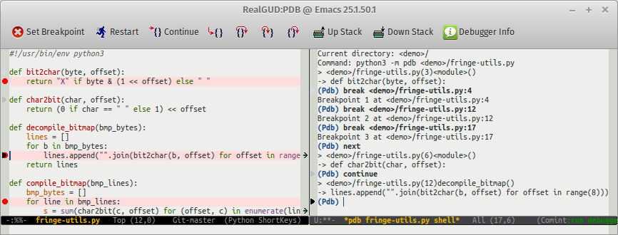

[![Build Status][travis-image]][travis-url]
[![GNU ELPA][gnu-elpa-image]][gnu-elpa]
[![MELPA][melpa-image]][melpa]
[![MELPA Stable][melpa-stable-image]][melpa-stable]


**An extensible, modular GNU Emacs front-end for interacting with external debuggers**, brought to you by **Rocky Bernstein** ([@rocky](https://github.com/rocky)) and **Clément Pit-Claudel** ([@cpitclaudel](https://github.com/cpitclaudel)).



# Setup

You can install RealGUD from [MELPA](http://melpa.org/#/getting-started), a repository of Emacs packages. If you don't have MELPA set up, add the following to your `.emacs` and restart Emacs:

```elisp
(require 'package)
(add-to-list 'package-archives '("melpa" . "http://melpa.org/packages/") t)
(package-initialize)
```

You can then run the following commands to install RealGUD:

```
M-x package-refresh-contents RET      (to refresh your package database)
M-x package-install RET realgud RET   (to install and compile `realgud` and its dependencies)
```

Alternatively, you can install RealGUD using [el-get](http://www.emacswiki.org/emacs/el-get) or from source directly. See [this article](https://github.com/realgud/realgud/wiki/How-to-Install) in our wiki for more info.

# Quick start

Use `M-x load-library RET realgud RET` to load RealGUD.

## Launching the debugger

Open a source file, then use `M-x realgud:<debugger-name>` to start your favorite debugger (for example, you can use `M-x realgud:pdb` to launch PDB, a Python debugger).  RealGUD opens two windows: the *command window* (showing the debugger's REPL), and the *source window*, showing your code (with some debuggers, such as `realgud:gdb`, this window does not appear until you type `start` in the *command window*).  An solid arrow `▶` indicates the current line in the source window.  Grayed out arrows indicate previous positions.

## Using the debugger

All usual debugger commands work in the command window: for example, you can type `n RET` in the command window to step forward one source line. But RealGUD's power lies in the source window: in it, most single keys correspond to a debugger action. For example, you can press `n` in the source window to step forward.

## Source window commands

Here is a quick rundown of the most useful commands. “🐁” indicates mouse commands (commands that can be run by clicking on a variable or in the margins). Many of the commands are accessible from the tool bar (`tool-bar-mode`) and the menu (`menu-bar-mode`).

* **Motion commands**

    | Command                                       | Action                                        |
    | --------------------------------------------- | --------------------------------------------- |
    | <kbd>n</kbd>, <kbd>F10</kbd>                  | Next (aka “step over”, “step through”)        |
    | <kbd>s</kbd>, <kbd>SPC</kbd>, <kbd>F11</kbd>  | Step (aka “step into”)                        |
    | <kbd>f</kbd>, <kbd>S-F11</kbd>                | Finish (aka “step out”, “return”)             |
    | <kbd>c</kbd>, <kbd>F5</kbd>                   | Continue (run to next break point)            |

* **Using breakpoints**

    | Command                                       | Action                                        |
    | --------------------------------------------- | --------------------------------------------- |
    | <kbd>b</kbd>, <kbd>F9</kbd>                   | Set breakpoint 🐁                              |
    | <kbd>D</kbd>                                  | Clear breakpoint 🐁 (by number)                |

* **Inspecting variables**

    | Command                                       | Action                                        |
    | --------------------------------------------- | --------------------------------------------- |
    | <kbd>mouse-2</kbd> (middle button)            | Inspect variable under cursor (in tooltip) 🐁  |
    | <kbd>e</kbd>                                  | Evaluate expression                           |

* **Control commands**

    | Command                                       | Action                                        |
    | --------------------------------------------- | --------------------------------------------- |
    | <kbd>q</kbd>, <kbd>S-F5</kbd>                 | Quit                                          |
    | <kbd>R</kbd>, <kbd>r</kbd>                    | Run (aka “restart”)                           |
    | <kbd>S</kbd>                                  | Go to command window                          |

# Supported debuggers

RealGUD supports [many external debuggers](https://github.com/realgud/realgud/wiki/Debuggers-Available).  Help us [support even more](https://github.com/realgud/realgud/wiki/How-to-add-a-new-debugger)!

# Advanced topics

## Extra commands

“⚙” indicates a work-in-progress (contributions welcome!)

| Command                                      | Action                                         |
| -------------------------------------------- | ---------------------------------------------- |
| <kbd>U</kbd>                                 | Until (run to a greater source line)           |
| <kbd>u</kbd>, <kbd>&gt;</kbd>                | Up stack (move to older stack frame)           |
| <kbd>d</kbd>, <kbd>&lt;</kbd>                | Down stack (move to younger stack frame)       |
| <kbd>X</kbd>                                 | Clear breakpoint (by line)                     |
| <kbd>j</kbd>                                 | Jump to current line ⚙                         |
| <kbd>-</kbd>                                 | Disable breakpoint ⚙                           |
| <kbd>+</kbd>                                 | Enable breakpoint ⚙                            |

## Tracking an existing debugger process

Use `M-x realgud-track-mode` inside an existing [shell](http://www.gnu.org/software/emacs/manual/html_node/emacs/Shell.html), or [eshell](https://www.gnu.org/software/emacs/manual/html_mono/eshell.html) buffer to track an already-running debugger process.

### RealGUD's wiki

Browse the [wiki](https://github.com/realgud/realgud/wiki) for more information about [setting up](https://github.com/realgud/realgud/wiki/How-to-Install), [using realgud](https://github.com/realgud/realgud/wiki/How-to-Use), [exploring features](https://github.com/realgud/realgud/wiki/Features), and lots more.

[travis-image]: https://api.travis-ci.org/realgud/realgud.svg?branch=master
[travis-url]: https://travis-ci.org/realgud/realgud
[gnu-elpa-image]: https://elpa.gnu.org/packages/realgud.svg
[gnu-elpa]: https://elpa.gnu.org/packages/realgud.html
[melpa-stable-image]: http://stable.melpa.org/packages/realgud-badge.svg
[melpa-stable]: http://stable.melpa.org/#/realgud
[melpa-image]: http://melpa.org/packages/realgud-badge.svg
[melpa]: http://melpa.org/#/realgud
